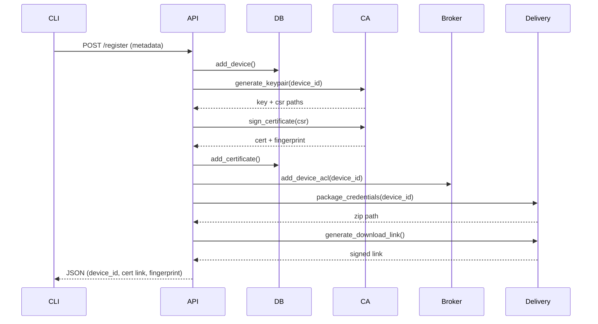
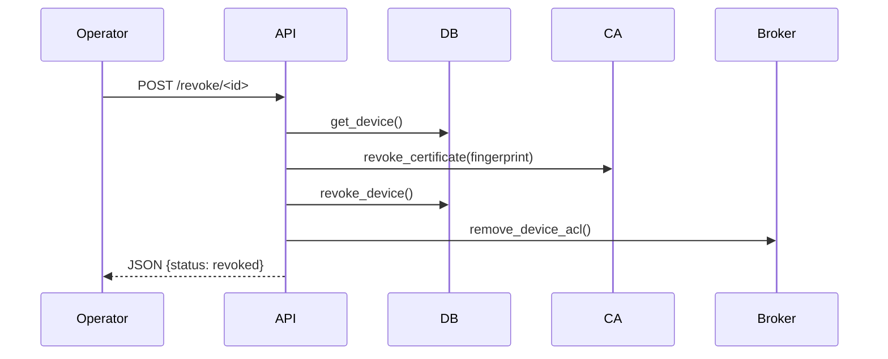

# Architecture

## Overview
The Secure IoT Device Onboarding Portal provides an automated workflow for registering IoT devices, issuing X.509 certificates, provisioning MQTT broker ACLs, and delivering credentials securely for mutual TLS authentication.

## Components
| Component | Responsibility |
|-----------|----------------|
| Flask API (`app.py`) | Orchestrates registration, revocation, queries |
| CA Module (`ca.py`) | Generates keys, signs CSRs, manages revocations & CRL |
| DB Layer (`db.py`) | Stores device & certificate metadata |
| Broker Provisioning (`broker_provisioning.py`) | Manages Mosquitto ACL entries |
| Credential Delivery (`credential_delivery.py`) | Packages certs/keys into protected bundles |
| CLI (`cli.py`) | Operator interface for common workflows |

## Sequence: Device Registration

## Sequence: Device Revocation

## Data Model
Device (1) --- (1) Certificate

| Device | Certificate |
|--------|-------------|
| id (UUID) | device_id (FK) |
| name | fingerprint |
| type | issued_at |
| location | expires_at |
| firmware | revoked (bool) |
| registered_at |  |
| status |  |

## Security Model
* Device identity: X.509 end-entity certificate CN = device UUID
* Broker authentication: mTLS; broker uses `use_identity_as_username true`
* Authorization: Topic-scoped ACL entries per device
* Confidentiality: TLS channel + optional encrypted ZIP for initial credential transport
* Integrity: SHA256 signatures on certificates
* Revocation: Local CRL file (extendable to distribution endpoint)

## Extensibility
Future improvements may include:
* OCSP / CRL HTTP distribution
* PKCS#11 HSM for CA key storage
* Multi-tenancy separation
* Device attestation token validation

